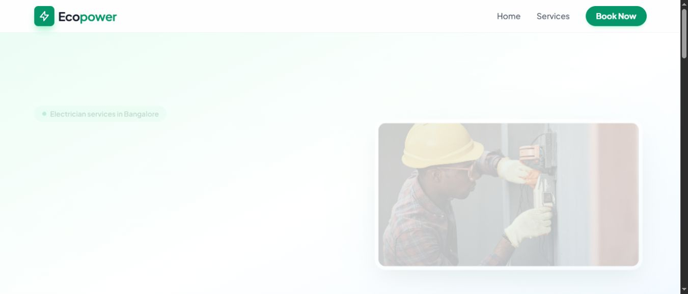

# Ecopower Electrician Services

A responsive service website and booking prototype for an electrician business in Bengaluru. It presents the available services, collects a booking request and opens a prefilled WhatsApp message for the visitor to send.



## Features

- Service sections, contact links and a service-area map.
- Booking form with a WhatsApp handoff and a fallback link.
- Browser-local booking history and a dashboard at `/#/admin`.
- Responsive layouts and Framer Motion animations.
- Hash-based routing that works on static hosting.

**Bookings are stored in the visitor's browser.** They are not sent to a shared database or automatically delivered to the business. The visitor must send the WhatsApp message. The dashboard only sees data stored in the same browser and origin, and its client-side password is a demo gate rather than secure authentication.

## Stack

React, TypeScript, Vite, React Router, Framer Motion and CSS. Tailwind is currently loaded from its browser CDN in `index.html`; there is no compiled Tailwind build step.

## Run locally

Use Node.js 22.

```sh
git clone https://github.com/itsshashank09/-ecopower-site.git
cd ./-ecopower-site
npm ci
npm run dev
```

Open `http://localhost:3000`.

```sh
npm run build
npx --no-install tsc --noEmit
npm run preview
```

`preview` serves the compiled `dist/` output. No API keys or backend are required for the frontend. To publish under a GitHub Pages repository subpath, set Vite's `base` to that subpath before building; the default is for a root-domain deployment.

## Structure and configuration

```text
App.tsx             Routes and page composition
components/         Landing sections, booking form and local dashboard
config.ts           Business WhatsApp number and message formatter
types.ts            Booking and service types
index.html          Page metadata, fonts and Tailwind CDN
vite.config.ts      Development server and build configuration
docs/screenshots/   Captured local preview
```

Set the business contact in `config.ts` before using the form for a different business. For a safe local review, browse the page and dashboard without sending a message to the real contact.

## What this project demonstrates

Component-based page composition, TypeScript data types, controlled forms, local persistence, hash routing and an external messaging handoff. A useful next step is moving booking delivery and staff authentication to a backend. The current client-side dashboard should not hold sensitive customer records.

No open-source licence is included in the repository.
